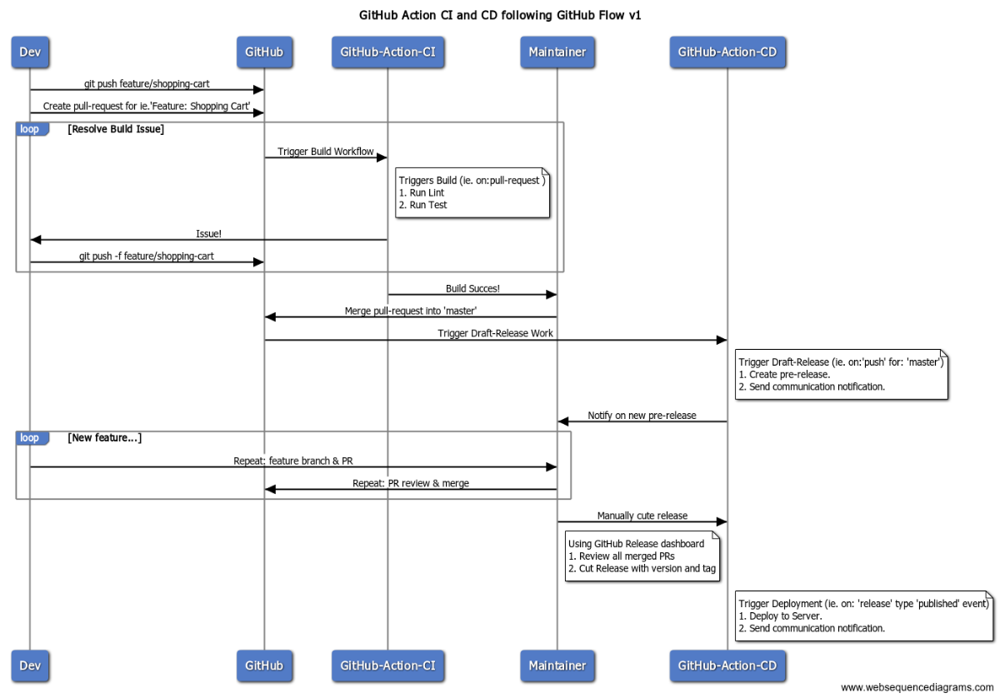

# My GitHub Action workflow with GitHub flow model

GitHub Action workflow with GitHub flow model.

GitHub flow model, [details](https://guides.github.com/introduction/flow/).

The short:

* `master` should always be deployable and lock down.
* `feature/...` or `chore/...` or `bug/...` or `refactor/...` is the only branch to get into `master`.
* GitHub PR is vehicle to merge into `master` interstate.
* Only `Fork` model security vs `Share` model. Trusts me, your `git` history will love you for it.
