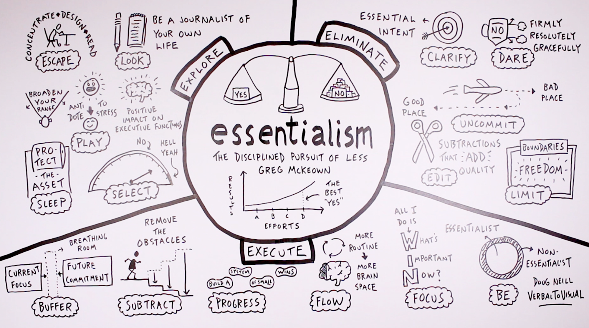

# Essentialism

By Greg McKeown

<ins>**TL;DR:**</ins> (My version only the critical essentials)

* **EXPLORE**
    * SLEEP (Not sure why its in Explore, but whatever)
    * SELECT (Hell ya, everything else is NO, NOPE)
    * LOOK (Journalist of your own life)

* **ELIMINATE**
    * CLARIFY (Essential intent)
    * EDIT (Subtract that *ADDs* quality)
    * LIMIT (Boundaries = Freedom )

* **EXECUTE**
    * BUFFER (Create breathing room)
    * FLOW (More routine, more brain space)
    * FOCUS (always W.I.N, Whats, Important, Now)

+++

### Full Cheat Sheet Graph
