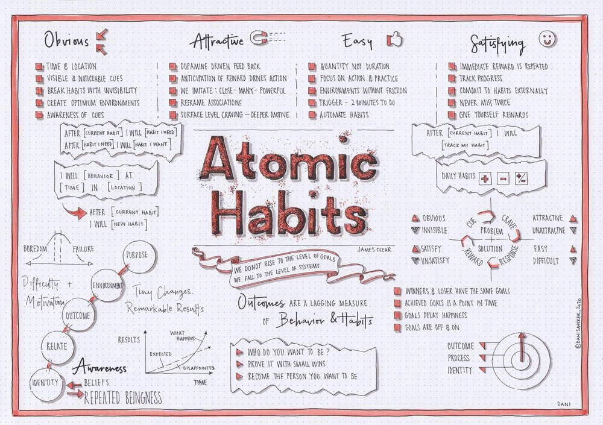

# Atomic Habits

Simplify because I'm slow. :smiley:

TL;DR:

* ***Obvious***
  * Time and Location: Optimum Environment Matter
  * Visible and Noticeable Cues
  * Break Habits by Making Invisibility
* Attractive
  * Anticipation of Awards Drives Action
  * Reframe Association
  * We Imitate: Close - Many - Powerful
* Easy
  * Quantity, NOT Duration
  * Focus on Action & Practice
  * Environment Without Frictions
* Satisfying
  * Track Progress
  * Never Miss Twice
  * Give Yourself Rewards

+++
