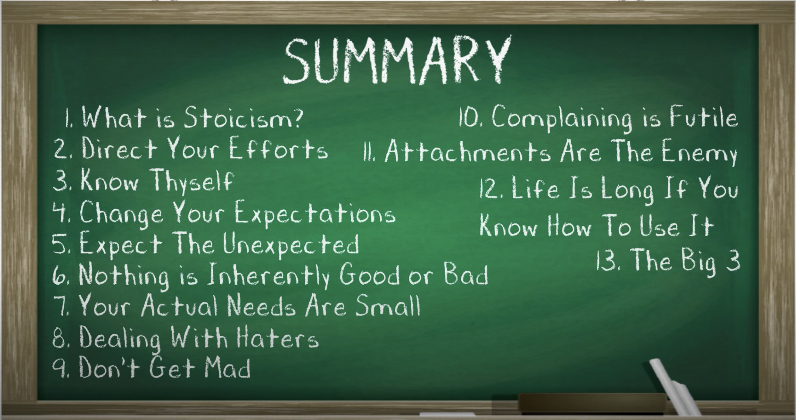

# Stoicism in 12

The mighty 12 of Stoicism because I'm slow. :smiley: The ***BOLD*** Lessons are what I have to remember!

TL;DR:

1. Direct Your Efforts
2. Know Thyself
3. Change Your Expectations
4. Expect the Unexpected
5. Nothing is Inherently Good or Bad
6. Your Actions Needs are Small
7. Dealing with Haters
8. ***Don't Get Mad***
9. ***Complaining is Futile***
10. ***Attachments are the Enemy***
11. Life is Long if you Know How to Use It
12. Big 3
  * ***1. Control Your Perceptions***
  * ***2. Direct Your Actions***
  * ***3. Accept What's Outside of Your Control***

+++
